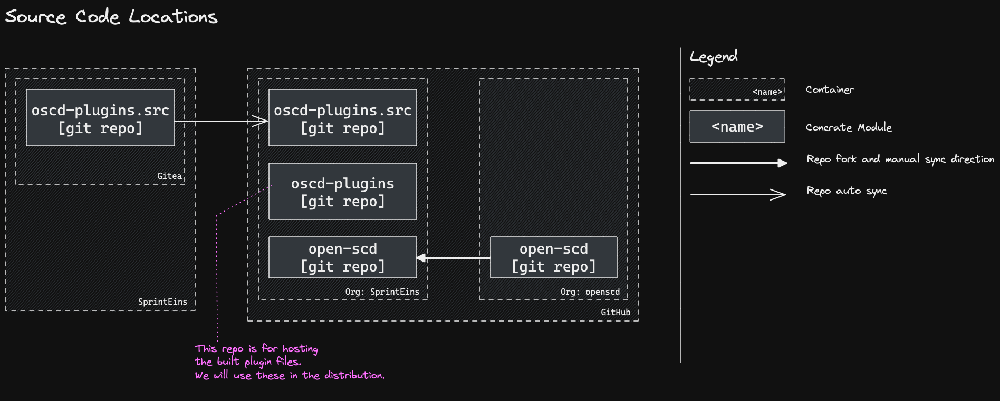

# 2. Use Monorepo-Polypackage Setup

Date: 2023-03-08

## Status

Accepted

## Context

We need a setup.

## Decision

- Q: Where do we have the plugins?
  - write the plugins directly in the forked repo - the CoMPAS project does this.
    This setup would be the simplest one but I think it would cause conflicts
	and problems when we have to sync the original repo into ours.
- A: We separate the the plugins but

- Q: should we create a monorepo or one repo per plugin?
  - one repo per plugin would be easy to think about and they would be also
    easier to deploy, however it would be harder to handle cross-cutting concerns
	like shared utilities, types, business models, documentations, diagrams etc...
  - monorepo: all cross-cutting concern is in one repo, but the deployment would be harder
- A: for now we go with monorepo because I think we can solve the deployment
  problems and sharing code between plugins is important.

- Q: Where should we store the repo?:
  - We can you GitHub because everything can be open-source.
    Being open-source has the advantage of having free services available.
	e.g.: GitHub Actions provide more minutes that we can use in the CI/CD pipeline.
	A disadvantage is that  we cannot really manage users through our SSO and it is harder to keep up with who has access to what
  - We can use our Gitea. We could manage access better but we would lose the perks of being open-source	
- A: We will use Gitea and synchronies the code to GitHub to use GitHub actions
  and publish the code as open-source. With this setup we will be able to use
  the extended minutes of GitHub Actions and other perks and still be able
  to manage access to our repos. One small advantage is that we won't use
  GitHub feature like "Discussions" in order to not complicate things more,
  but this is not a big problem

We will Use [pnpm ↗](https://pnpm.io/), [pnpm-workspace ↗](https://pnpm.io/workspaces)
and [turborepo ↗](https://turbo.build/repo) to create a nice developer experience

## Consequences

- By splitting up into multiple packages we can release different versions 
of the plugins at different times
- Working in a monorepo makes sharing common functionality easier
- By using the pnpm, workspaces and turborepo we will hide the complexity 
of poly-package repos and make it easy to work with
