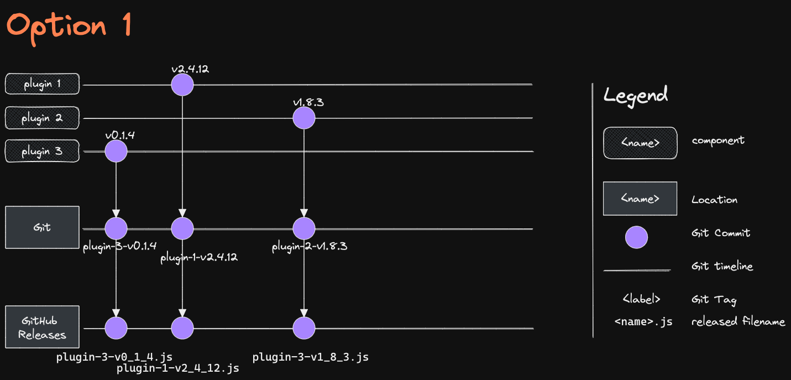
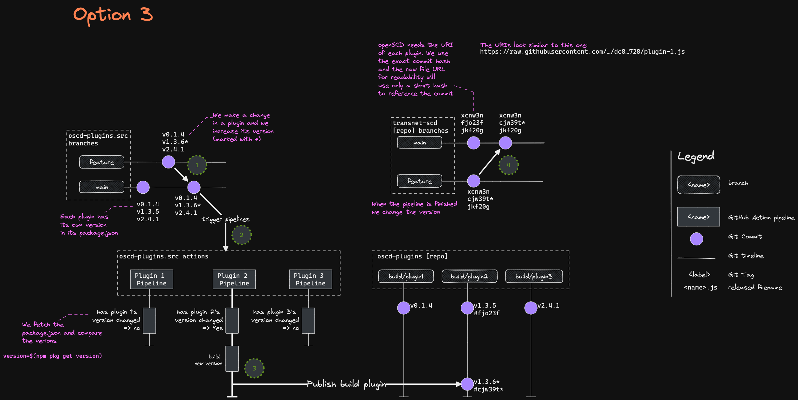

# 3. Release Process

Date: 2023-03-15

## Status

Accepted

## Context

We need a way to release each plugin independently each other and enable
our customer to test new version before release.

## Decision

We will implement [Option 3](#option-3)

## Options 

### Option 1

We increase the plugins' version in their `package.json` and we automatically tag
the commit with something like `plugin-1-v0.4.1` from this a pipeline some could
detect a new tag and build a new GitHub Release.

The problem with GitHub releases is that they semantically represent a singular product.
We could just name the releases also like "plugin-1" and only upload a file like `plugin-1-v0_4_1.js`.

Unfortunately we can not have a reference to a beta or actual release this way because
we always have to reference the exact release. We could always release every
plugin but somehow this just does not feel right.

### Option 2

Similar to [Option 1](#option-1) when we change the version in `package.json` the pipeline could detect
if a plugin has a new version and build it. We would store the result not in GitHub Releases
but in dedicated branches e.g.: `plugin-1/latest`  `plugin-2/beta`

With this we can have release channels we could use "latest" and "beta" for staging environments.

The problem arises when we want to move a new version of a plugin from the `beta` to `main` branch
but we have other plugins in `beta` that we do not want to release just yet.

Also the process would take place on GitHub through GitHub Actions and would
modify the repository that gets synchronized from our Gittea. This could also lead to problems.

I've tried out this approach and having the source code and managing the build
files in dedicated branches is not trivial and has too many edge-cases to be worth it

### Option 3

To solve the previous problems we separate our source- and output files into separate
repositories: `oscd-plugin.src` for the source files and `oscd-plugin` for the built plugin files.

1. If we have a change in a plugin we would increase its version in the `package.json` just like before.
2. Every merge into the main branch starts all the pipelines.
3. The pipelines check If their configured plugin has changed and if yes then they
   build it and push the new files into the `oscd-plugins` repo.
   Each plugin gets its own branch. This allows us to deploy them independently
   and have a reference to the newest build.
4. In the configuration of TransnetSCD we would reference the urls through there
   exact commit hash, so if we want to use a newer version of the plugin in
   production we just change its URI and the app loads the new version.

We can still have a "nightly" deployment where we always use the newest version of all plugins.
If needed we could extend the solution with version suffixes like `v1.4.2-beta`,
where the pipelines could set tags on the commits and we can use that
to deploy a "beta-only" environment. But It is not needed at the moment.

## Consequences

- We have to dedicated repository which is easier to reason about
- No need to take care of all the edge cases of [Option 2](#option-2)
