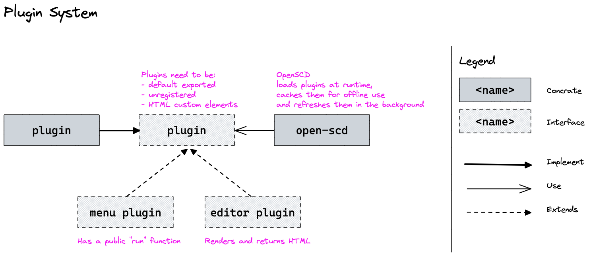

# Architecture

## Context 

We mainly work on TransnetSCD that is a distribution of OpenSCD for [TransnetBW ↗](https://www.transnetbw.de/en).

We have the following user groups:
- Engineer: they plan the substations
- Technicians: they implement and maintain the substations

Both group will interact with TransnetSCD.


## Source Code Locations

- `oscd-plugins.src`: is the where the main work happens. 
We host it at our own git server to manage user through our SSO and we synchronize it to a 
[public repository on GitHub ↗](https://github.com/sprinteins/oscd-plugins.src)


- `oscd-plugins`: we use this repo to store the built plugin files. 
  We make use of the versioning aspect.
  > **Note:** See more about in the release process: TODO: Link

- `open-scd`: the repo in the SprintEins organization is a fork of the one in the OpenSCD organization.


## Project Structure

The project is an monorepo.

- you can find the packages in the `./packages` folder
- you can find the documentation in the `./doc` folder


We have currently the following packages:

```
├── core
├── plugins
│   ├── communication-explorer
│   ├── diffing-tool
│   └── network-explorer
└── uilib
```

- `core` contains the business models and any interaction with the `.scd` files
- each plugin has its own package in `plugins` folder. Plugins are just a lightweight 
  wrapper around the plugin components that manage the file handling and interaction
  with the core of OpenSCD (not with our core!)
- `uilib` is where all the ui components and the plugin components are.
  we develop the plugins here so we can work independent of the file system and files.


## OpenSCD's Plugin System

A plugin needs to:
- default export an HTML custom-element class
- the custom-element cannot be registered
- be deployed somewhere where OpenSCD can load the JavaScript files from

