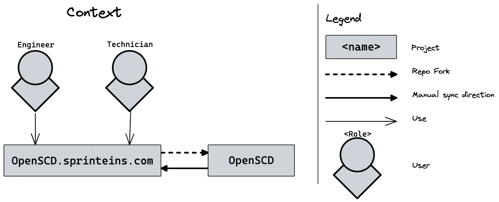
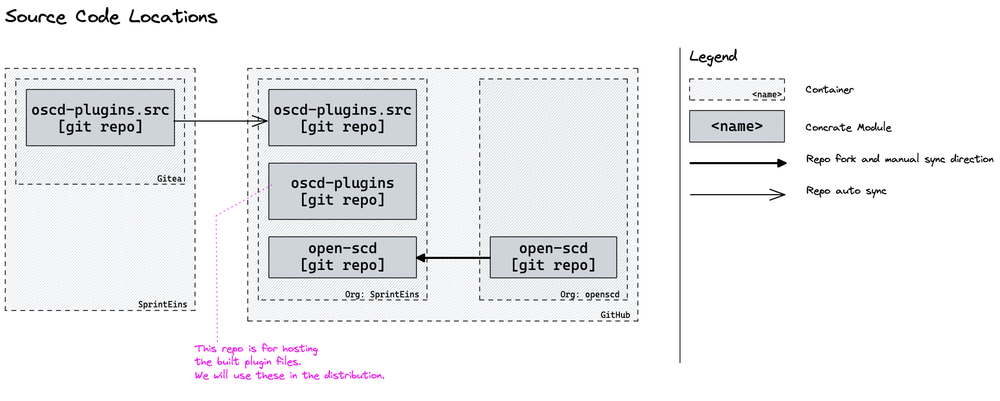

# Architecture

## Context 

We mainly work on TransnetSCD that is a distribution of OpenSCD for [TransnetBW ↗](https://www.transnetbw.de/en).

We have the following user groups:
- Engineer: they plan the substations
- Technicians: they implement and maintain the substations

Both group will interact with TransnetSCD.

## Source Code Locations

- `oscd-plugins.src`: is the where the main work happens. 
We host it at our own git server to manage user through our SSO and we synchronize it to a 
[public repository on GitHub ↗](https://github.com/sprinteins/oscd-plugins.src)

- `oscd-plugins`: we use this repo to store the built plugin files. 
  We make use of the versioning aspect.
  > **Note:** See more about in the release process: TODO: Link

- `open-scd`: the repo in the SprintEins organization is a fork of the one in the OpenSCD organization.

