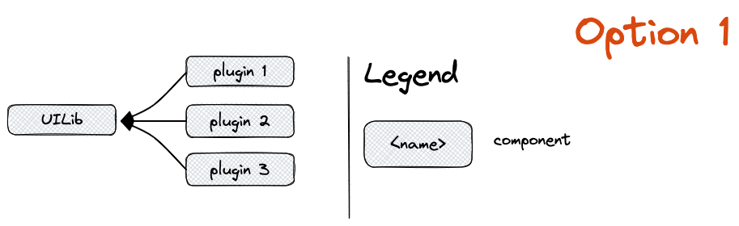
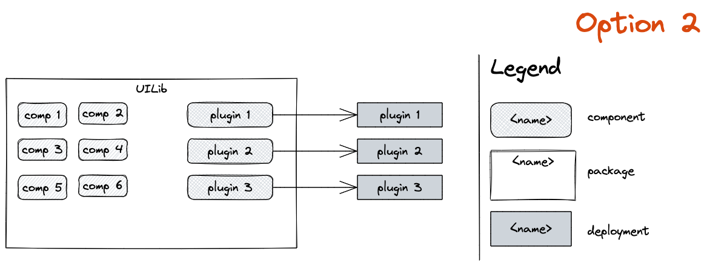

# RFC 0001: Basic Architecture

## Context

- We will need to implement multiple plugins for the [OpenSCD ↗](https://github.com/openscd/open-scd) project
- We prefer monorepo setups
- We will have common ui components
- We will probably have common business logic and helpers

## Design

We apply [Option 1](#option-1) because 

## Options

### Option 1

We create a common UILib package and each plugin gets its own package.

### Option 2

We use a single package and 

